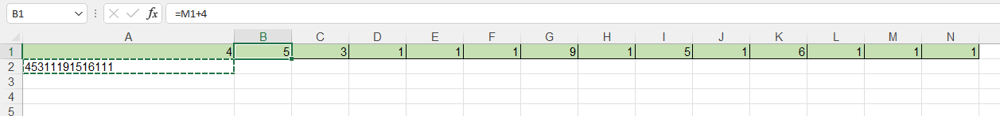

```
inp w    inp w    inp w    inp w    inp w    inp w     inp w    inp w    inp w    inp w     inp w    inp w     inp w     inp w
mul x 0  mul x 0  mul x 0  mul x 0  mul x 0  mul x 0   mul x 0  mul x 0  mul x 0  mul x 0   mul x 0  mul x 0   mul x 0   mul x 0
add x z  add x z  add x z  add x z  add x z  add x z   add x z  add x z  add x z  add x z   add x z  add x z   add x z   add x z
mod x 26 mod x 26 mod x 26 mod x 26 mod x 26 mod x 26  mod x 26 mod x 26 mod x 26 mod x 26  mod x 26  mod x 26 mod x 26  mod x 26
div z 1  div z 1  div z 1  div z 1  div z 26 div z 26  div z 1  div z 1  div z 26 div z 26  div z 1  div z 26  div z 26  div z 26
add x 10 add x 11 add x 14 add x 13 add x -6 add x -14 add x 14 add x 13 add x -8 add x -15 add x 10 add x -11 add x -13 add x -4
eql x w  eql x w  eql x w  eql x w  eql x w  eql x w   eql x w  eql x w  eql x w  eql x w   eql x w  eql x w   eql x w   eql x w
eql x 0  eql x 0  eql x 0  eql x 0  eql x 0  eql x 0   eql x 0  eql x 0  eql x 0  eql x 0   eql x 0  eql x 0   eql x 0   eql x 0
mul y 0  mul y 0  mul y 0  mul y 0  mul y 0  mul y 0   mul y 0  mul y 0  mul y 0  mul y 0   mul y 0  mul y 0   mul y 0   mul y 0
add y 25 add y 25 add y 25 add y 25 add y 25 add y 25  add y 25 add y 25 add y 25 add y 25  add y 25 add y 25  add y 25   add y 25
mul y x  mul y x  mul y x  mul y x  mul y x  mul y x   mul y x  mul y x  mul y x  mul y x   mul y x  mul y x   mul y x   mul y x
add y 1  add y 1  add y 1  add y 1  add y 1  add y 1   add y 1  add y 1  add y 1  add y 1   add y 1  add y 1   add y 1   add y 1
mul z y  mul z y  mul z y  mul z y  mul z y  mul z y   mul z y  mul z y  mul z y  mul z y   mul z y  mul z y   mul z y   mul z y
mul y 0  mul y 0  mul y 0  mul y 0  mul y 0  mul y 0   mul y 0  mul y 0  mul y 0  mul y 0   mul y 0  mul y 0   mul y 0   mul y 0
add y w  add y w  add y w  add y w  add y w  add y w   add y w  add y w  add y w  add y w   add y w  add y w   add y w   add y w
add y 1  add y 9  add y 12 add y 6  add y 9  add y 15  add y 7  add y 12 add y 15 add y 3   add y 6  add y 2   add y 10   add y 12
mul y x  mul y x  mul y x  mul y x  mul y x  mul y x   mul y x  mul y x  mul y x  mul y x   mul y x  mul y x   mul y x   mul y x
add z y  add z y  add z y  add z y  add z y  add z y   add z y  add z y  add z y  add z y   add z y  add z y   add z y   add z y
```

## Pattern 1

```
inp w           | w = Wi
mul x 0         |
add x z         | x = prevZ % 26
mod x 26        |
div z 1         | z = prevZ
add x 10 <-- L6 | x = x + L6          |    x = (prevZ % 26) + L6                        |
eql x w         | x = x = Wi ? 1 : 0  | => x = if Wi = (prevZ % 26) + L6 then 1 else 0  | => x = if Wi != (prevZ % 26) + L6 then 1 else 0
eql x 0         | x = x = 0 ? 1 : 0   |    x = if x = 0 then 1 else 0                   |
mul y 0         |
add y 25        |
mul y x         |
add y 1         | y = 25 * x + 1
mul z y         | z = z * (25 * x + 1) = prevZ * (25 * x + 1)
mul y 0         |
add y w         |
add y 1 <-- L16 |
mul y x         | y = (Wi + L16) * x
add z y         | z = prevZ * (25 * x + 1) + (Wi + L16) * x
```

If we look at the input, for pattern 1, L6 always >= 10 => x is always 1
```
=> z = 26 * prevZ + (Wi + L16)
```

## Pattern 2

```
inp w             | w = Wi
mul x 0           |
add x z           |
mod x 26          | x = prevZ % 26
div z 26  <--     | z = prevZ / 26
add x -6  <-- L6  | x = x + L6          | x = (prevZ % 26) + L6                           |
eql x w           | x = x = Wi ? 1 : 0  | => x = if Wi = (prevZ % 26) + L6 then 1 else 0  | => x = if Wi != (prevZ % 26) + L6 then 1 else 0
eql x 0           | x = x = 0 ? 1 : 0   | x = if x = 0 then 1 else 0                      |
mul y 0           |
add y 25          |
mul y x           |
add y 1           | y = 25 * x + 1
mul z y           | z = z * (25 * x + 1) = (prevZ / 26) * (25 * x + 1)
mul y 0           |
add y w           |
add y 9   <-- L16 |
mul y x           | y = (Wi + L16) * x
add z y           | z = (prevZ / 26) * (25 * x + 1) + (Wi + L16) * x
```

Since the L6 for pattern 2 is always negative, x may be 0 or 1

```
if Wi != (prevZ % 26) + L6 then
    z = prevZ + (Wi + L16)
else
    z = prevZ / 26
```

After applying pattern 1 N times, we have

```
26 * (26 * ... (26 * (...) + K) + ...) + A
```

The number of `26` is `N-1`, since the first z is `0`

If we encounter pattern 2:

```
if Wi == (prevZ % 26) + L6
(26 * ... (26 * (...) + K) + ...) (N-2 26) (1)

if Wi != (prevZ % 26) + L6
26 * (26 * ... (26 * (...) + K) + ...) + A' (N-1 26)
```

(1) Note that A or K or whatever added is Wi + L16, since L16 <= 15 and Wi <= 9 => Wi + L16 <= 24

```
=> (26 * K + (Wi + L16)) / 26
    = (26 * K) / 26 + (Wi + L16) / 26
    = K             + 0 (round down)
    = (26 * K' + (Wi' + L16')) (Minus one 26)
```

Another important note due to Wi + L16 <= 24

```
(26 * K + (Wi + L16)) % 26 = Wi + L16
```

We have 7 patterns 1 and 7 patterns 2 in the input. With 7 pattern 1, we have 7 - 1 = 6 "26 * something".

To get the final z equal to 0, we need 7 "divide by 26". To archive that, all the conditions in 7 patterns 2 must evaluate to false.

```
=> Wi == (prevZ % 26) + L6
```

With the above conclusion, we can build a relationship between 14 input digits and deduce the max and min. Let try it:

### Step 1, pattern 1
```
w = A

z1 = A + 1
```
### Step 2, pattern 1
```
w = B

z2 = 26 * z1 + (B + 9)
```
### Step 3, pattern 1
```
w = C

z3 = 26 * z2 + (C + 12)
```
### Step 4, pattern 1
```
w = D

z4 = 26 * z3 + (D + 6)
```
### Step 5, pattern 2
```
w = E

if E != (z4 % 26) -6 then
    ...
else
    z5 = z4 / 26

=>
E = D + 6 - 6
z5 = z4 / 26

=>
E = D
z5 = z3
```
### Step 6, pattern 2
```
w = F

if F != (z5 % 26) - 14 then
    ...
else
    z6 = z5 / 26

With z5 = z3

=>
F = C - 2
z6 = z2
```
### Step 7, pattern 1
```
w = G

z7 = 26 * z2 + (G + 7)
```
### Step 8, pattern 1
```
w = H

z8 = 26 * z7 + (H + 12)
```
### Step 9, pattern 2
```
w = I

if I != (z8 % 26) - 8 then
    ...
else
    z9 = z8 / 26

=>
I = H + 4
z9 = z7
```
### Step 10, pattern 2
```
w = J

if J != (z9 % 26) - 15 then
    ...
else
    z10 = z9 / 26

With z9 = z7

=>
J = G - 8
z10 = z2
```
### Step 11, pattern 1
```
w = K

z11 = 26 * z2 + (K + 6)
```
### Step 12, pattern 2
```
w = L

if L != (z11 % 26) - 11 then
    ...
else
    z12 = z11 / 26

=>
L = K - 5
z12 = z2
```
### Step 13, pattern 2
```
w = M

if M != (z12 % 26) - 13 then
    ...
else
    z13 = z12 / 26

With z12 = z2

=>
M = B - 4
z13 = z1
```
### Step 14, pattern 2
```
w = N

if N != (z13 % 26) - 4 then
    ...
else
    z14 = z13 / 26

With z13 = z1

=>
N = A - 3
z14 = 0
```

Finally, we get
```
E = D
F = C - 2
I = H + 4
J = G - 8
L = K - 5
M = B - 4
N = A - 3

or (Sorted to throw into excel)

A = N + 3
B = M + 4
C = F + 2
D = E
G = J + 8
H = I - 4
K = L + 5
```


