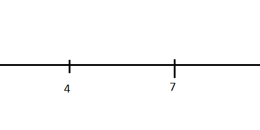
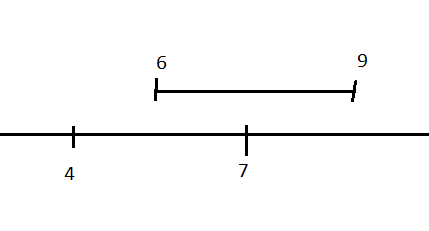
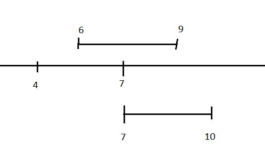
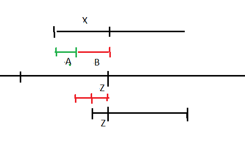
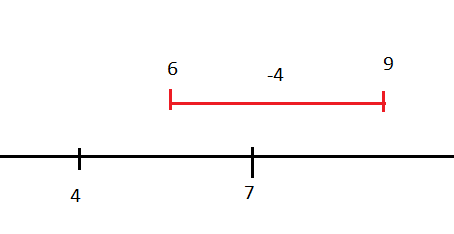
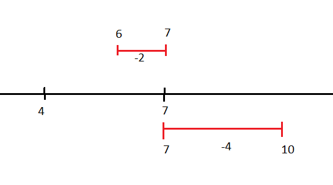

This problem isn't the hardest one this year IMO. However, thinking about cube overlapping is to much for my brain.

So I resorted to using 2D shape, didn't help either. Luckily, we can visualize the problem in 1D line, then expand it to n-dimensions easily.

Consider the input only have x:

```
on x=4..7
on x=6..9
on x=7..10
```

Step1: we draw a line from 4 to 7, thus, we have 4 "on" reactors



Step2: draw a line from 6 to 9



The total on reactors are

```
4 + 4 + (-2) = 6
```

Since the 2 lines are overlap, we need to add a (-2) to the sum. Think as we have an "on" line from 4 to 7, an other from 6 to 9 and an "compensatory" line from 6 to 7

Step3: add the third line from 7 to 10



Apply the same process above, we think the result will be

```
4 + 4 + (-2)
+ 4 // 7..10
+ (-3) // 7..10 intersect with 6..9
+ (-1) // 7..10 intersect with 4..7
= 6
```

Which is wrong, the final result should be `10 - 4 + 1 = 7`

The problem here is our processes are ordered, so in reality the "compensatory" line is applied before the intersect checking for the new like occur.

So to get the correct result, we need to apply the "compensatory" line before perform intersect checking for the new line

Either apply it to line 4..7 or 6..9, the result is the same

```
// if apply compensatory line 6..7 to line 4..7 and get a new on line 4..5
2 // 4..5
+ 4 // 6..9
+ 4 // 7..10
+ (-3) // 7..10 intersect with 6..9
= 7

// if apply compensatory line 6..7 to line 6..9 and get a new on line 8..9
4 // 4..7
+ 2 // 8..9
+ 4 // 7..10
+ (-1) // 7..10 intersect with 4..7
+ (-2) // 7..10 intersect with 8..9
= 7
```

One way to solve this problem is apply the "compensatory" lines after each step. It is easy with line, but things get tedious and error prone when apply to 2D rectangles and 3D cubes, because the result is not always a new rectangle or a new cube. If the 2 rectangles or cubes are adjacent to each other the final result is a series of sub-rectangles or sub-cubes.

We can make use of the "compensatory" line to solve this. Knowing these things:

- If the new line intersects with the "compensatory" line, it should intersects with the real line (without applying the "compensatory" line)
- After applying the "compensatory" line to the real line, that section of the real line is removed and can not be intersected with anything

So, if a new line intersects with a "compensatory" line with value `B` , then some where in the calculation, it would produce the same amount of intersection with a real line (`B`), but this is a duplication, because after applying the  "compensatory" line, the intersection isn't exist. So we need to add a `-B` (flip the sign, `B` can be negative) to the sum to eliminate the duplicate.

In the picture below, the  "compensatory" line is the red line, to get the correct intersect value between the new line and the new line:

```
A // correct intersect value
= X // intersect between two real lines without applying the "compensatory" line
+ (-B) // intersection between new line and "compensatory" line, then flip the sign
```



Apply to our starting example

```
4 + 4 + (-2)
+ 4 // 7..10
+ (-3) // 7..10 intersect with 6..9
+ (-1) // 7..10 intersect with 4..7
+ 1 // 7..10 intersect with 6..7 and flip the sign
= 7
```

The process so far (if new line is "on" line):
- If there is no intersection, add it to the sum
- If there is intersection with "on" line, add the new line and an "off" line which has length equal to the intersection's length as "compensatory" line
- If there is intersection with "off" line, add the new line and an "on" line which has length equal to the intersection's length to eliminate duplication.

  We do not store real "off" lines from input (more explain later), so intersections with "off" line is always with "compensatory" line, hence de-dup is required.

Now, if the new line is "off" line.

Step 1



After step 1, if we apply the "compensatory" line, it should be

```
4 + (-2)
= 2
```

For off lines, we don't need to add them to the sum, we just need to add the intersections ("compensatory" line). If there is none, that off line doesn't affect current state. (aka it doesn't turn anything off)

After step 1, we have an "on" line (4..7) and a "compensatory" line (6..7)

Now, for next step, consider we have 2 case:
- The next line is an "on" line from 7 to 10. Apply what we concluded so far, the result is

  ```
  4 + (-2)
  + 4 + (-1) // 7..10 intersect with 4..7
  + 1 // 7..10 intersect with 6..7 and flip the sign
  = 6
  ```

  Which is correct, if we doing so by applying "compensatory" line first. We have an on line from 4..5, after adding the on line 7..10, we have 6 on reactors.

- The next line is an "off" line from 7 to 10:

  

  We can apply the same process, without applying the "compensatory" line 6..7 first, line 7..10 would produce an intersection 7..7 with line 4..7.

  Hence, a de-duplication is require

  ```
  4 // 4..7
  + (-2) // 6..9 intersect with 4..7
  + 0 // remove 6..9
  + (-1) // 7.10 intersect with 4..7
  + 1 // 7..10 intersect with 6..7 and flip the sign
  + 0 // remove 7..10
  = 2
  ```

Conclusion:
- The operation of the intersection (on or off) is the opposite of the *old line*
- If the new line is an "off" line, remove it after intersect checking

With above conclusion, we can come up with this solution:
- If there is no line yet, put the new line to the line list if it is an "on" line
- If there are lines in the line list, perform intersect checking for all of them with the new line.

  If there is intersection, the decision for it (on or off) is the opposite of the *old line*.
- If the new line is an "off" line, remove it after intersect checking, otherwise add it to the list
- If there no line left, sum the length of the lines in the list, on lines are positive, off lines are negative
- For rectangles, the final step is summing their areas, for cube summing their volumes. The intersect checking are also different.
